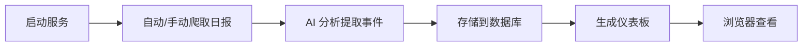

# Tita 日报分析系统

> 基于 AI 大模型的销售日报智能分析工具，自动从 Tita 平台爬取日报，提取结构化事件，生成可视化仪表板。

---

## 📂 目录结构

```
tita-市场/
├── README.md                      # 本文档
├── config.json                    # 配置文件（API密钥、Cookie等）
├── business_knowledge.md          # 业务知识库（产品定义、阶段标准）
├── tita_logs.db                   # SQLite 数据库
│
├── *.py (7个核心脚本)              # 核心 Python 脚本
│
├── 启动入口/                       # 启动脚本
│   ├── start_service.bat          # 主服务 (推荐)
│   └── run_v3.bat                 # v3分析 (标签自生长)
│
├── 工具脚本/                       # 辅助工具
│   ├── cookie_refresher.py        # Cookie扫码刷新
│   ├── cleanup_duplicates.py      # 清理重复数据
│   └── inspect_db.py              # 查看数据库结构
│
├── 输出/                           # 生成的文件
│   ├── daily_report_dashboard.html
│   ├── quality_dashboard.html
│   ├── opportunity_dashboard.html
│   └── daily_report_*.md
│
├── 日志/                           # 运行日志
├── 文档/                           # 需求文档
└── 归档/                           # 过时版本备份
```

---

## 🚀 快速开始

### 1. 安装依赖
```bash
pip install flask apscheduler requests selenium webdriver-manager
```

### 2. 配置
编辑 `config.json`：
- `volcengine_api_key`: 火山引擎 API 密钥
- `headers.cookie`: Tita 登录 Cookie
- `target_departments`: 目标部门 ID

### 3. 启动服务
双击 **`启动入口/start_service.bat`**，浏览器将自动打开 http://localhost:8080

---

## 📜 核心脚本说明

| 脚本 | 功能 |
|:-----|:-----|
| `tita_service.py` | **一体化服务** - Web服务器 + 定时任务 + Cookie管理 |
| `daily_log_aggregator.py` | 爬取 Tita 日报 + AI 分析 + 存储数据库 |
| `generate_dashboard.py` | 生成可视化仪表板 HTML |
| `extract_events_v3.py` | v3 事件抽取 - 支持双跑一致性、置信度 |
| `promote_tags.py` | 标签晋升 - 将候选标签晋升为 stable |
| `discover_aliases.py` | 别名发现 - 自动发现学校/产品别名 |
| `upgrade_schema_v3.py` | v3 数据库升级 |

---

## 🔧 工具脚本说明

| 脚本 | 功能 | 使用方式 |
|:-----|:-----|:-----|
| `cookie_refresher.py` | Selenium 扫码刷新 Cookie | `python 工具脚本/cookie_refresher.py` |
| `cleanup_duplicates.py` | 清理数据库重复事件 | `python 工具脚本/cleanup_duplicates.py` |
| `inspect_db.py` | 查看数据库表结构 | `python 工具脚本/inspect_db.py` |

---

## 📊 使用流程



### 日常使用
1. **双击 `启动入口/start_service.bat`**
2. 浏览器访问 http://localhost:8080
3. 点击"手动拉取"获取最新日报

### Cookie 失效时
- 系统会自动弹出扫码窗口
- 或手动运行 `python 工具脚本/cookie_refresher.py`

### 使用 v3 标签自生长
1. 双击 `启动入口/run_v3.bat`
2. 系统会执行双跑抽取 → 标签晋升 → 别名发现

---

## ⚙️ 配置说明

### config.json 结构
```json
{
    "tita_api_url": "Tita API 地址",
    "headers": { "cookie": "登录 Cookie" },
    "volcengine_api_key": "火山引擎 API Key",
    "volcengine_endpoint_id": "模型 Endpoint ID",
    "target_departments": ["部门ID"],
    "keepalive": { "enabled": true, "start_hour": 8, "end_hour": 18 }
}
```

### business_knowledge.md
定义产品线、阶段标准等业务知识，AI 分析时参考。

### Cookie 共享配置
本项目与 `自动完成周报` 项目共享 Cookie，存储于：
```
f:\共享配置\tita_cookie.json
```
- **本项目负责 Cookie 的刷新和保活**
- 刷新后会自动同步到共享文件，其他项目无需手动更新

---

## 📁 归档说明

`归档/` 目录包含过时的 v1/v2 版本文件，保留供参考：

| 文件 | 说明 |
|:-----|:-----|
| `analyze_opportunities.py` | v1 事件分析（已被 v3 取代） |
| `update_db_schema.py` | v1 数据库（已被 v3 取代） |
| `api_server.py` | 独立 API 服务（已集成到 tita_service） |
| `cookie_keeper.py` | 独立保活（已集成到 tita_service） |
| `v2.0_机会管理系统/` | v2 版本备份 |

---

## 🔍 常见问题

**Q: Cookie 失效怎么办？**
- 运行 `python 工具脚本/cookie_refresher.py` 扫码刷新

**Q: 数据库有重复数据？**
- 运行 `python 工具脚本/cleanup_duplicates.py`

**Q: 如何查看数据库结构？**
- 运行 `python 工具脚本/inspect_db.py`

---

*更新时间: 2026-01-22*
